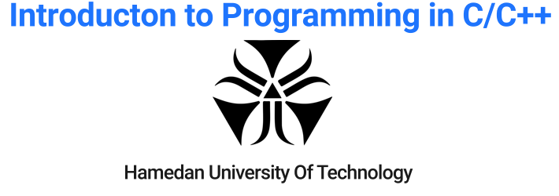
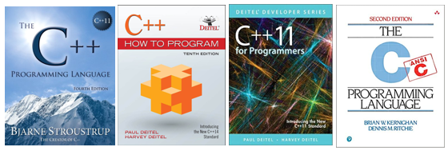

# intro-programming

<p align="center">
  
</p>


> Introduction to Programming in C/C++, Supervisor: Prof. Hassan Bashiri

> *Computer Engineering Department of Hamedan University of Technology*

> Course Material by [Prof. Hassan Bashiri](http://profs.hut.ac.ir/~bashiri), and [Mr. Ali Mohammadpour](https://github.com/alimpk)

> **Current Semester: 2022 Semester**

## Synopsis
Welcome to Fandamental of Programming in C/C++ for BSc. ! Here you will find friendly slides, small codes, and projects designed specfically for C/C++ beginners with limited programming experiences.


## Refrences

1. [**C++ How to Program**, 10th Edition, Harvey Deitel, and Paul Deitel, 2017]()
2. [**The C++ Programming Language**, 4th Edition, Harvey Deitel, and Paul Deitel, 2013]()
3. [**The C Programming Language**, 2nd Edition, Dennis Ritchie, and Brian Kernighan, 1978]()
4. [**The C++ Programming Language**, 4th Edition, Bjarne Stroustrup, 2013]()

<p align="center">
  
</p>

# Quick Start

* The archive directory contains all of non-common course materials for last semesters, you can use them for more practices.
* The material directory contains all course learning/teaching/materials
* The assignment directory contains all of Problem Sets and Assignments that has template design files.
* The samples directory is contains all of sample cores for subjects.

## How to complete Lab course as good student

[1] Clone repository to own account.

[2] Don't upload your codes in public domain, use github private project or university gitlab server

[3] Update cloned branch for new assignments template

* Add the remote, call it "upstream":
```bash 
    git remote add upstream https://github.com/hut-ce/intro-programming
    git fetch upstream
    git checkout main
    git rebase upstream/main
```

[4] Create new branch for assignments (`git branch pr-main`)

[5] commit your codes in branch (`git add pr-main & git commit`)

[6] set branch remote to private repository like CEIT Gitlab (`git push -u https://git.hut.ir/aut.ac.ir/XYZ pr-main`)

[7] after passing the course, add your id and semester in last line of *who-know-cpp-course.md file by pull request.

## Teaching Assistants and Lab Instructors over Semesters

Dear TA, Lab instructor, you can add your name and semester in [who-had-cpp-ta.md](./who-had-cpp-ta.md) file by pull request or create new issue.
